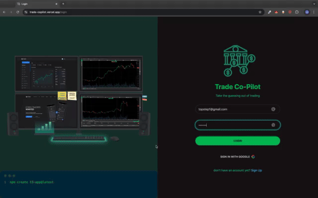
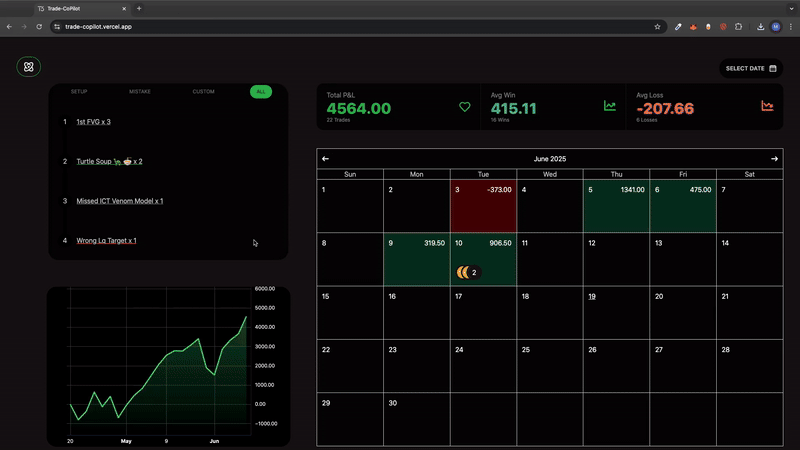

# 📈 Trade Copilot

**Trade Copilot** is a full-stack trade tracking application built to help traders import, journal, and analyze their trades with ease. At its core, the app allows users to **import trade data from CSV files**, transforming traditional pen-and-paper journaling into a modern, searchable, and interactive experience.

With powerful features like interactive trade charts, tagging, rich-text journaling, and performance analytics, Trade Copilot offers a complete post-trade review workflow.

> 🧑‍💻 Built for personal use, designed with production-quality practices to showcase full-stack development, database architecture, and data visualization capabilities.

>
> 


---

## 🔍 Features

- 📊 **Visual Trade Analysis**  
  Interactive charts (via Lightweight Charts) to view entries, exits, and market context.

- 🏷️ **Tagging System**  
  Categorize trades by strategy, emotion, or market condition for filtering and pattern recognition.

- 📝 **Trade Journaling**  
  Write rich-text notes using TinyMCE to reflect on trade rationale and psychology.

- 🗒**Trade List View**  
  Display all trades taken, browse and filter trades based on trading sessions.

- 📈 **CSV Import**  
Supports different broker-exported CSVs. Automatically parses date, symbol, entry/exit, PnL, and more.
 > 

---

## Create T3 App

This is a [T3 Stack](https://create.t3.gg/) project bootstrapped with `create-t3-app`.

## ⚙️ Tech Stack

| Layer        | Technology                         |
|--------------|-------------------------------------|
| Frontend     | React 18 + Next.js 13               |
| Styling      | Tailwind CSS + DaisyUI + Framer     |
| State Mgmt   | Zustand + React Query               |
| Forms        | React Hook Form + Zod               |
| Backend      | tRPC + Prisma                       |
| Database     | Supabase (Postgres)                 |
| Auth         | NextAuth.js (Supabase Adapter)      |
| Charts       | Lightweight Charts                  |
| Deployment   | Vercel                              |
| Tooling      | Prettier, ESLint, TypeScript        |

---

## 🚀 Live Demo

🔗 [**View Deployed App**](https://your-vercel-url.vercel.app)  

---

## 🛠️ Getting Started

Clone and run locally:

```bash
git clone https://github.com/yourusername/trade-copilot.git
cd trade-copilot
pnpm install
pnpm dev
